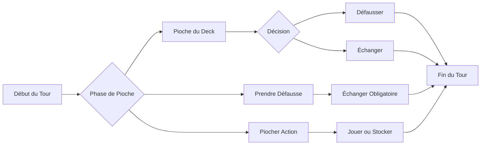

# 🎮 Règles Complètes du Jeu Ojyx

> **Note** : Ce document reflète l'implémentation actuelle du jeu basée sur l'analyse du code source. Certaines fonctionnalités prévues dans les spécifications initiales sont encore en développement.

## 🎯 Vue d'Ensemble Rapide

**Objectif** : Obtenir le score le plus bas possible  
**Joueurs** : 2 à 8 joueurs  
**Durée** : 30-45 minutes par manche  
**Concept** : Gérez une grille de 12 cartes face cachée et utilisez stratégie et cartes actions pour minimiser vos points

## 📋 Table des Matières

1. [Guide de Démarrage Rapide](#guide-de-démarrage-rapide)
2. [Composants du Jeu](#composants-du-jeu)
3. [Mise en Place](#mise-en-place)
4. [Déroulement d'un Tour](#déroulement-dun-tour)
5. [Cartes Actions Détaillées](#cartes-actions-détaillées)
6. [Mécaniques Spéciales](#mécaniques-spéciales)
7. [Fin de Partie et Scoring](#fin-de-partie-et-scoring)
8. [Guide Multijoueur](#guide-multijoueur)
9. [Référence Rapide](#référence-rapide)
10. [Incohérences Identifiées](#incohérences-identifiées)

## Guide de Démarrage Rapide

### 🚀 Votre Première Partie en 5 Minutes

1. **Rejoignez une partie** avec 2-8 joueurs
2. **Recevez 12 cartes** face cachée en grille 3×4
3. **Révélez 2 cartes** de votre choix au début
4. **À votre tour** : Piochez, échangez ou défaussez
5. **Objectif** : Avoir le score le plus bas quand quelqu'un révèle ses 12 cartes

> 💡 **Astuce** : Les cartes négatives (-2, -1) réduisent votre score !

## Composants du Jeu

### 🃏 Cartes Numériques (160 cartes au total)

| Valeur | Quantité | Couleur | Points |
|--------|----------|---------|--------|
| -2 | 5 cartes | 🔵 Bleu foncé | -2 points |
| -1 | 10 cartes | 🔵 Bleu foncé | -1 point |
| 0 | 15 cartes | 🔷 Bleu clair | 0 point |
| 1-4 | 10 chacune | 🟢 Vert | 1-4 points |
| 5-8 | 10 chacune | 🟡 Jaune | 5-8 points |
| 9-12 | 10 chacune | 🔴 Rouge | 9-12 points |

### ⚡ Cartes Actions (37 cartes)

Le jeu inclut 12 types de cartes actions pour pimenter vos parties. Voir la [section dédiée](#cartes-actions-détaillées) pour les détails.

## Mise en Place

### Configuration Initiale

1. **Distribution** : Chaque joueur reçoit 12 cartes face cachée
2. **Disposition** : Arrangez vos cartes en grille 3 lignes × 4 colonnes
3. **Révélation initiale** : Choisissez et révélez 2 de vos cartes
4. **Défausse** : Retournez la première carte de la pioche pour créer la défausse

```
Votre Grille au Début :
┌───┬───┬───┬───┐
│ ? │ ✓ │ ? │ ? │  ✓ = Carte révélée
├───┼───┼───┼───┤  ? = Carte cachée
│ ? │ ? │ ? │ ✓ │
├───┼───┼───┼───┤
│ ? │ ? │ ? │ ? │
└───┴───┴───┴───┘
```

## Déroulement d'un Tour

### 📊 Flow d'un Tour Complet



### Phase 1 : Pioche

À votre tour, choisissez **UNE** action :

#### Option A : Piocher du Deck 🎴
- Prenez la carte du dessus (face cachée)
- Regardez-la secrètement
- Décidez : la garder ou la défausser

#### Option B : Prendre de la Défausse ♻️
- Prenez la carte visible du dessus
- **Obligation** : Vous devez l'échanger avec une carte de votre grille

#### Option C : Piocher une Carte Action ⚡
- Tirez une carte action
- Appliquez son effet (immédiat ou stockable)

### Phase 2 : Décision

**Si vous avez pioché du deck :**
- **Défausser** : Placez la carte dans la défausse
- **Échanger** : Remplacez une carte de votre grille (révélée ou cachée)
  - La nouvelle carte est automatiquement révélée
  - L'ancienne carte va dans la défausse

### Phase 3 : Actions (Optionnel)

- Jouez des cartes actions de votre stock (max 3)
- Certaines cartes sont **obligatoires** (voir section dédiée)

### Phase 4 : Fin de Tour

- Vérification automatique des colonnes complètes
- Le tour passe au joueur suivant

## Cartes Actions Détaillées

### 🟢 Cartes Obligatoires (Immediate)

Ces cartes **DOIVENT** être jouées dès qu'elles sont piochées :

#### 🔄 Demi-tour (turnAround) - 3 exemplaires
- **Effet** : Inverse le sens du jeu
- **Timing** : Immédiat et obligatoire
- **Stratégie** : Peut perturber l'ordre de jeu prévu

### 🟡 Cartes Optionnelles

Ces cartes peuvent être jouées immédiatement ou stockées (max 3 en main) :

#### Cartes de Mouvement

##### 🚀 Téléportation (teleport) - 4 exemplaires
- **Effet** : Échangez deux cartes de VOTRE grille
- **Cible** : Vos propres cartes
- **Stratégie** : Optimisez votre disposition pour créer des colonnes

##### 🔄 Échange (swap) - 3 exemplaires
- **Effet** : Échangez une de vos cartes avec celle d'un adversaire
- **Cible** : 1 adversaire à choisir
- **Stratégie** : Volez une carte avantageuse ou donnez une mauvaise carte

#### Cartes d'Information

##### 👁️ Coup d'œil (peek) - 4 exemplaires
- **Effet** : Regardez secrètement une carte adverse
- **Cible** : 1 carte adverse
- **Stratégie** : Planifiez vos échanges futurs

##### 📢 Révélation (reveal) - 2 exemplaires
- **Effet** : Révélez une carte adverse à tous les joueurs
- **Cible** : 1 carte adverse
- **Stratégie** : Exposez les bonnes cartes des adversaires

#### Cartes de Manipulation

##### ⏭️ Saut (skip) - 4 exemplaires
- **Effet** : Le prochain joueur passe son tour
- **Cible** : Automatique
- **Stratégie** : Empêchez un adversaire proche de la victoire de jouer

##### 🎰 Mélange (shuffle) - 2 exemplaires
- **Effet** : Mélangez aléatoirement votre grille
- **Cible** : Votre grille
- **Stratégie** : Tentez votre chance si votre disposition est mauvaise

#### Cartes d'Attaque/Défense

##### 🛡️ Bouclier (shield) - 3 exemplaires
- **Effet** : Protégez-vous des attaques ce tour
- **Timing** : Réactif (jouable hors de votre tour)
- **Stratégie** : Gardez-la pour contrer vol ou malédiction

##### 🏴‍☠️ Vol (steal) - 2 exemplaires
- **Effet** : Volez une carte action à un adversaire
- **Cible** : 1 adversaire avec des cartes en stock
- **Stratégie** : Privez un adversaire de ses options

##### 💀 Malédiction (curse) - 2 exemplaires
- **Effet** : Doublez le score d'une colonne adverse
- **Cible** : 1 colonne d'un adversaire
- **Stratégie** : Ciblez les colonnes de cartes élevées

#### Cartes Utilitaires

##### 🎴 Pioche (draw) - 3 exemplaires
- **Effet** : Piochez 2 cartes actions supplémentaires
- **Cible** : Deck d'actions
- **Stratégie** : Remplissez votre stock d'options

##### 💚 Soin (heal) - 2 exemplaires
- **Effet** : Divisez par 2 le score d'une de vos colonnes
- **Cible** : 1 colonne de votre grille
- **Stratégie** : Réduisez drastiquement une colonne à score élevé

### 🔴 Cartes Réactives

Ces cartes peuvent être jouées en réponse aux actions adverses :

- **Bouclier** : Protection contre les attaques
- **Mirror** (non implémenté) : Renvoie l'effet à l'attaquant

## Mécaniques Spéciales

### 🎯 Colonnes Identiques

**Règle d'Or** : 3 cartes identiques révélées dans une colonne = 0 points !

```
Exemple de Colonne Validée :
┌───┐
│ 7 │ ← Les trois
├───┤   cartes ont
│ 7 │   la même
├───┤   valeur
│ 7 │ = 0 points !
└───┘
```

- Vérification automatique à chaque révélation
- La colonne entière est défaussée
- Stratégie clé pour réduire votre score

### 📊 Système de Scoring

#### Calcul du Score
```
Score = Somme de toutes vos cartes × Multiplicateur
```

#### Réduction de Score
1. **Cartes négatives** : -2 et -1 réduisent directement
2. **Colonnes identiques** : 0 points pour la colonne
3. **Carte Soin** : Divise par 2 le score d'une colonne

### ⚠️ Pénalité de l'Initiateur

**Attention** : Si vous déclenchez la fin de manche mais n'avez PAS le score le plus bas :
- Votre score est **DOUBLÉ** (multiplicateur ×2)
- Stratégie : Assurez-vous d'avoir un bon score avant de finir !

## Fin de Partie et Scoring

### 🏁 Déclenchement de la Fin

1. Un joueur révèle sa **12ème et dernière carte**
2. Ce joueur devient l'**initiateur de fin de manche**
3. Tous les autres joueurs ont droit à **UN dernier tour**

### 📈 Calcul Final

1. **Révélation automatique** : Toutes les cartes cachées sont révélées
2. **Calcul des scores** : Somme de toutes les cartes de chaque joueur
3. **Application de la pénalité** : ×2 si l'initiateur n'a pas le plus bas score
4. **Vainqueur** : Le joueur avec le score le plus bas gagne !

### 🏆 Exemple de Scoring Final

```
Joueur A (initiateur) : 45 points → 90 points (pénalité ×2)
Joueur B : 52 points
Joueur C : 38 points ← GAGNANT !
Joueur D : 61 points
```

## Guide Multijoueur

### 🌐 Jouer en Ligne

#### Ce qu'il faut savoir
- 📡 Connexion internet stable requise
- 💾 Sauvegarde automatique de votre progression
- 🔒 Protection anti-triche par validation serveur
- ⚡ Actions synchronisées en temps réel

### 🔗 Gestion des Connexions

#### Le Système de "Battement de Cœur"
Comme un pouls, le jeu vérifie régulièrement que vous êtes toujours là :
- ✅ Vérification toutes les 30 secondes
- ⏱️ 2 minutes pour revenir en cas de déconnexion
- 🎮 Votre partie continue sans vous si déconnecté
- 📊 Votre score est préservé

#### États de Connexion
- 🟢 **En ligne** : Tout fonctionne parfaitement
- 🟡 **Connexion lente** : Légers délais possibles
- 🔴 **Déconnecté** : Vérifiez votre connexion
- ⏳ **Reconnexion** : Retour en cours...

### 🛡️ Sécurité et Équité

> 💡 **Comment ça marche ?**
> 
> Toutes vos actions sont vérifiées par un "arbitre automatique" (le serveur) qui s'assure que :
> - Personne ne peut tricher
> - Les règles sont respectées
> - Tout le monde voit les mêmes informations

## Référence Rapide

### 📝 Aide-Mémoire du Tour

1. **Piocher** : Deck, Défausse ou Action
2. **Décider** : Garder ou Défausser
3. **Jouer** : Actions optionnelles
4. **Vérifier** : Colonnes complètes
5. **Passer** : Au joueur suivant

### 🎯 Rappel des Objectifs

- **But** : Score le plus bas
- **Stratégies clés** :
  - Créer des colonnes identiques (0 points)
  - Garder les cartes négatives
  - Éviter la pénalité ×2
  - Utiliser les actions au bon moment

### ⚡ Actions Rapides

| Carte | Effet | Timing |
|-------|-------|--------|
| 🔄 Demi-tour | Inverse le sens | Obligatoire |
| 🚀 Téléportation | Échange dans votre grille | À volonté |
| 👁️ Coup d'œil | Regarde une carte | À volonté |
| 🛡️ Bouclier | Protection | En réaction |

## Incohérences Identifiées

> ⚠️ **Note pour les développeurs** : Cette section documente les différences entre l'implémentation actuelle et les spécifications initiales.

### 🔴 Fonctionnalités Manquantes

1. **Cartes Actions Non Implémentées** (9/21 types)
   - reverse, discard, freeze, mirror, bomb, duplicate, gift, gamble, scout

2. **Mécaniques de Jeu**
   - Révélation obligatoire après défausse directe
   - Phase simultanée de révélation initiale
   - Système de vote de fin de manche
   - Mécanisme de score figé pour les déconnexions

3. **Interface**
   - Vue spectateur dynamique
   - Chat en jeu
   - Choix volontaire des cartes initiales à révéler

### 🟡 Différences Mineures

- **Distribution** : 160 cartes implémentées vs 150 prévues
- **Deck d'actions** : 37 cartes vs nombre non spécifié

---

## 📚 Pour Aller Plus Loin

<details>
<summary>🔍 Détails Techniques (Cliquez pour développer)</summary>

### Architecture Technique
- **Frontend** : Flutter (Dart) - Application mobile native
- **Backend** : Supabase - Base de données temps réel
- **Synchronisation** : WebSockets pour le multijoueur
- **Sécurité** : Validation côté serveur de toutes les actions

### Optimisations
- Circuit breaker pour éviter la surcharge
- Batch updates pour regrouper les actions
- Connection pooling pour la performance

</details>

---

*Document généré automatiquement à partir du code source - Version du 2025-07-27*