# Architecture de Synchronisation Multijoueur - Ojyx

## Vue d'ensemble

Le système multijoueur d'Ojyx utilise une architecture hybride combinant l'état optimiste local avec la synchronisation temps réel via Supabase. Cette approche garantit une expérience utilisateur fluide tout en maintenant la cohérence des données entre tous les joueurs.

### Composants principaux

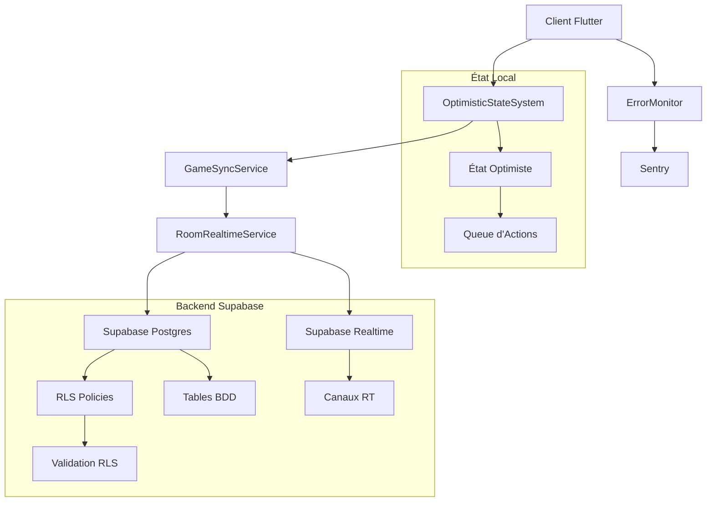

## Architecture Technique

### 1. Couche Client (Flutter)

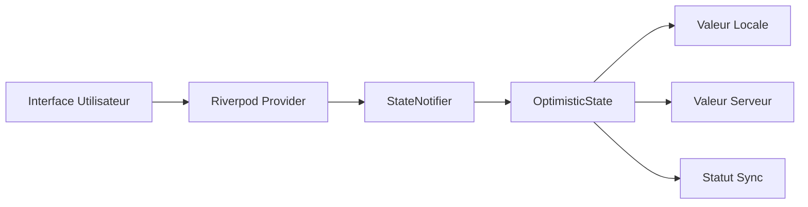

### 2. Couche Synchronisation

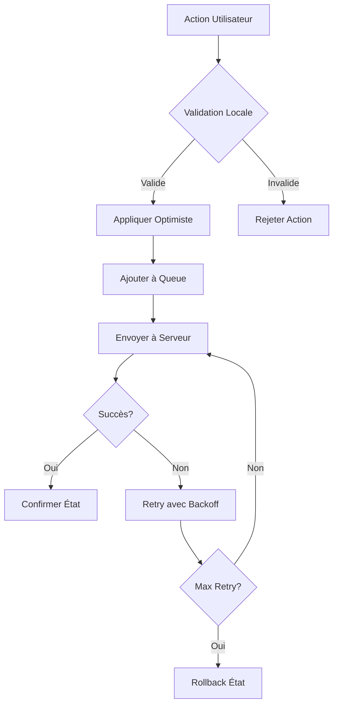

## Flux de Données Détaillés

### 1. Action Locale → État Optimiste

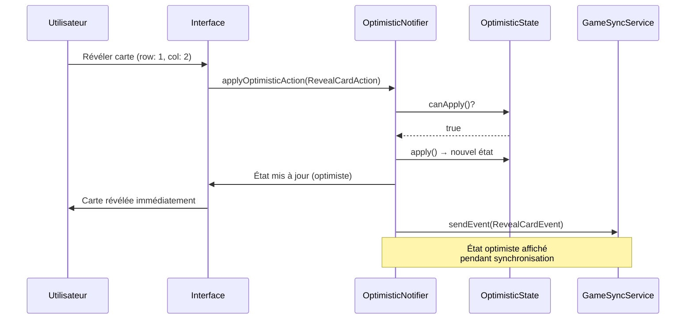

### 2. Broadcast Supabase Realtime

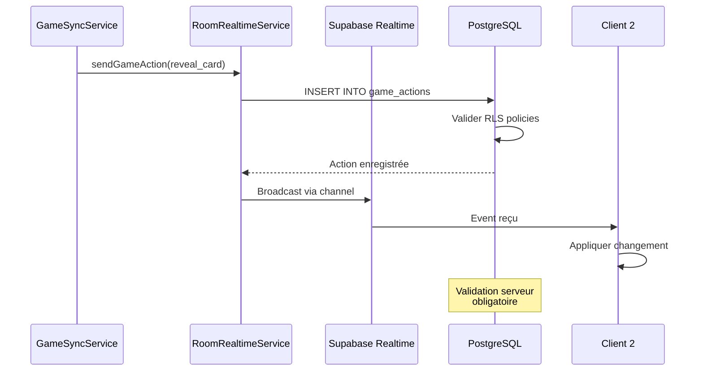

### 3. Validation Serveur & Cohérence

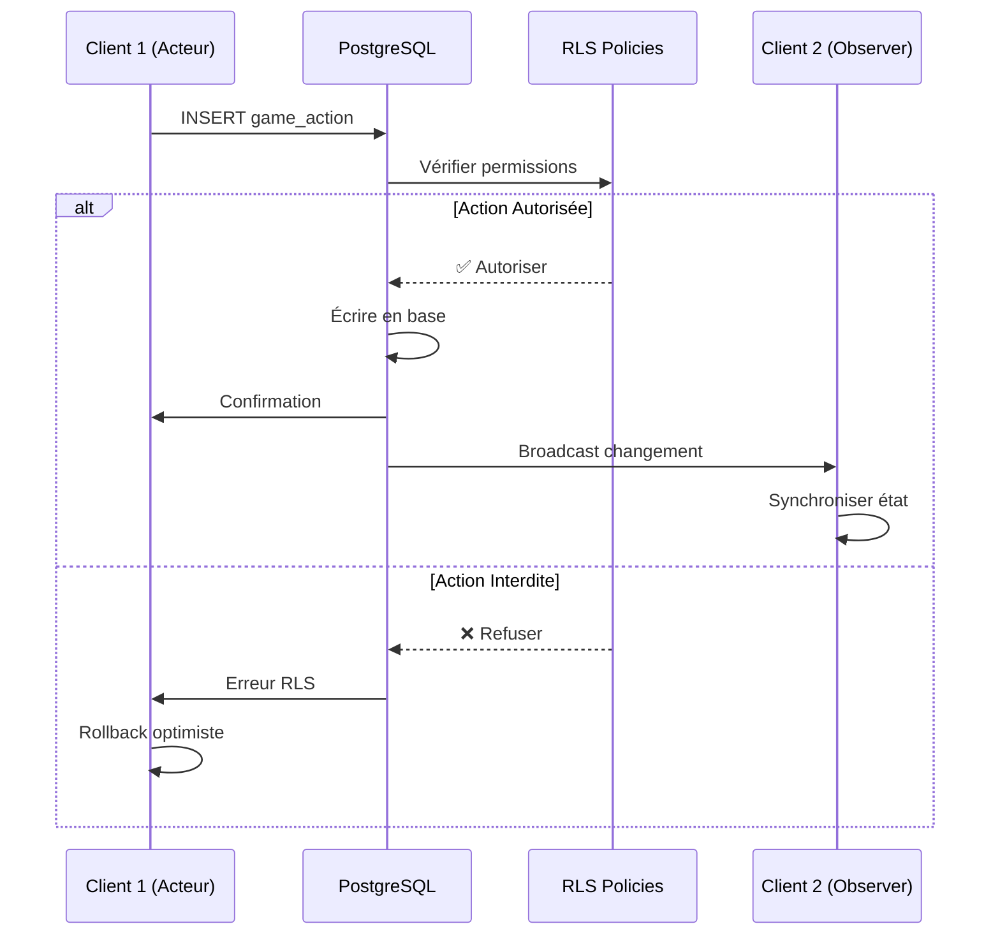

### 4. Synchronisation Multi-Clients

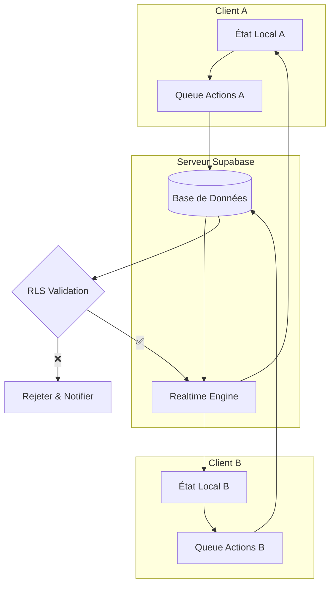

## Points de Synchronisation Critiques

### 1. Révélation de Cartes

**Timing critique** : L'ordre de révélation doit être respecté pour éviter les avantages inéquitables.

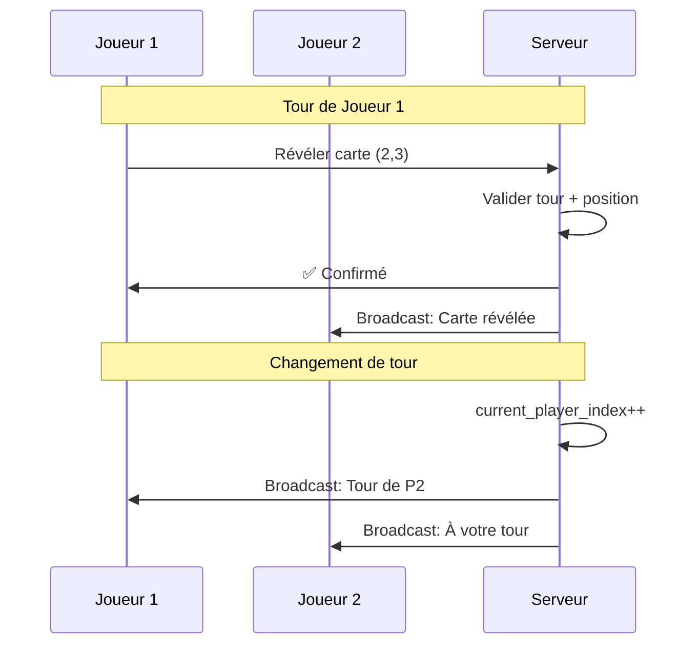

**Points de contrôle** :
- ✅ Vérifier que c'est le tour du joueur
- ✅ Valider que la carte n'est pas déjà révélée
- ✅ Contrôler la position (0-2, 0-3)
- ✅ Mettre à jour le tour après l'action

### 2. Actions de Cartes

**Complexité** : Les cartes actions peuvent affecter plusieurs joueurs simultanément.

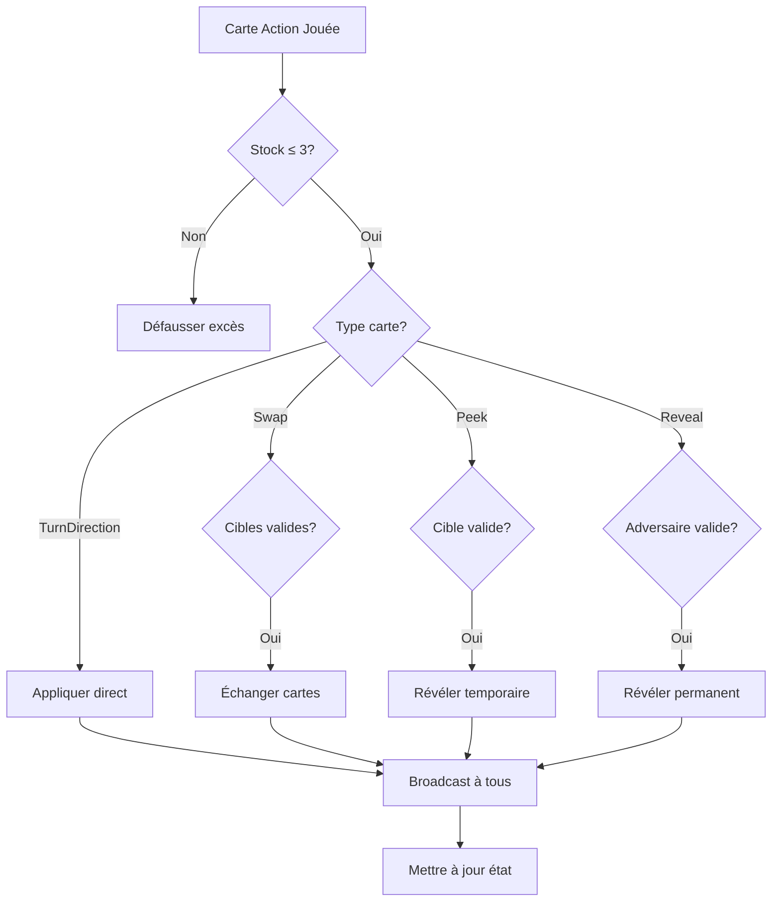

### 3. Validation de Colonnes

**Règle métier** : 3 cartes identiques révélées = colonne défaussée (0 points).

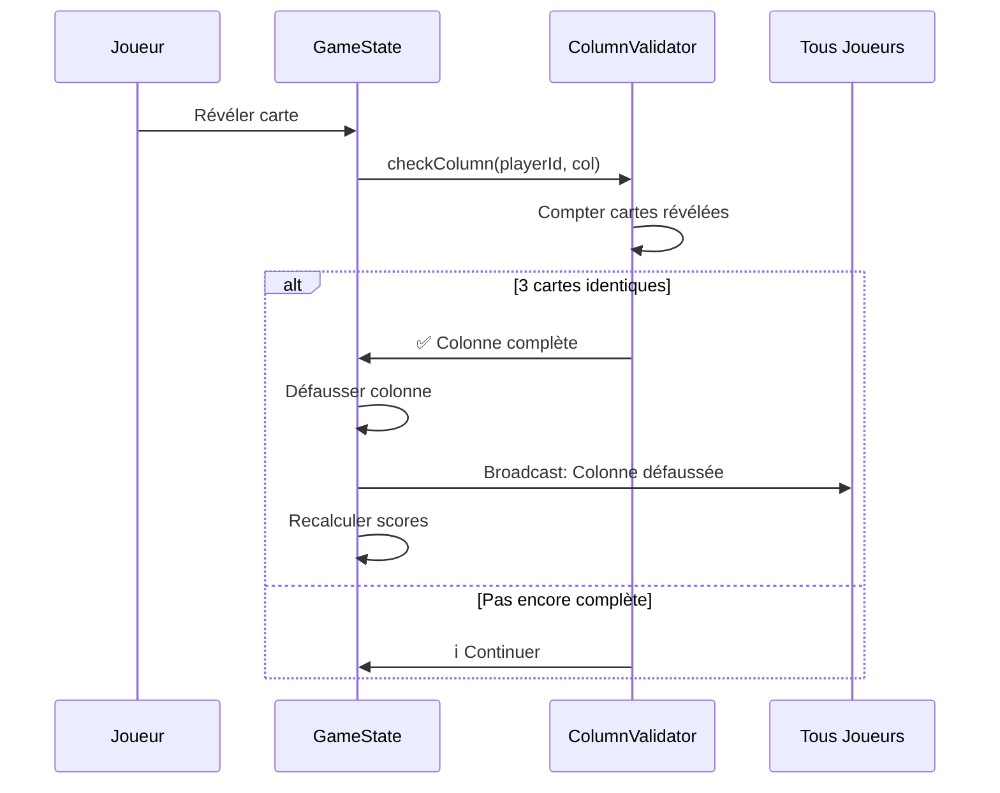

### 4. Fin de Manche

**Déclenchement** : Quand un joueur révèle sa 12ème carte.

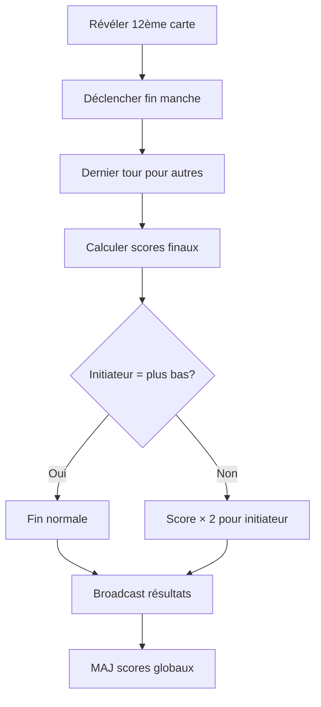

## Mécanismes de Récupération

### 1. Rollback Automatique

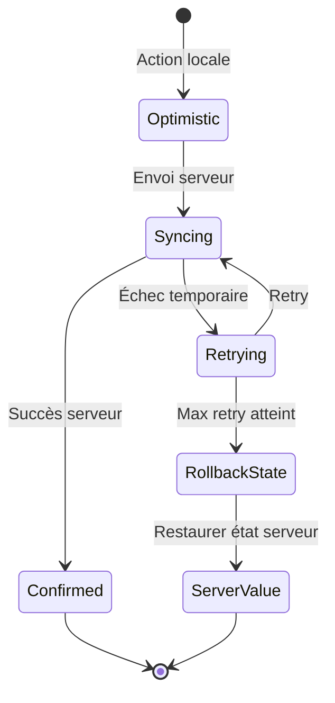

### 2. Gestion des Déconnexions

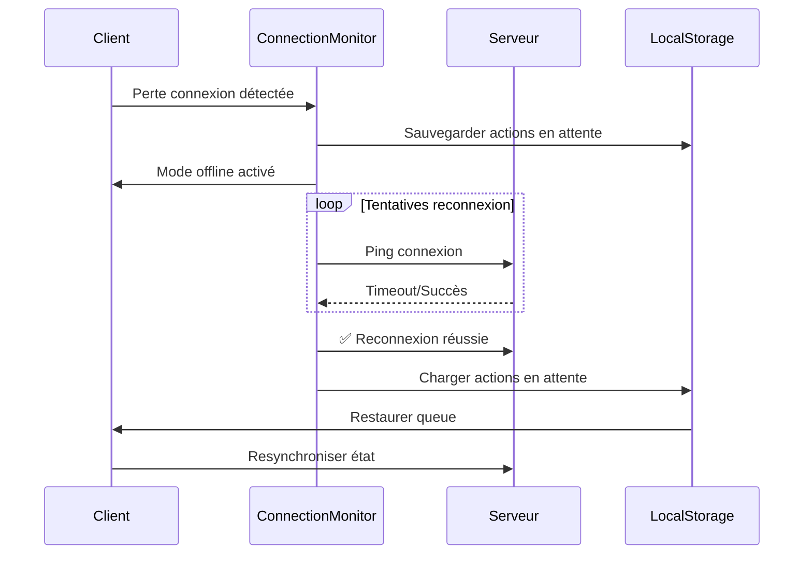

### 3. Résolution de Conflits

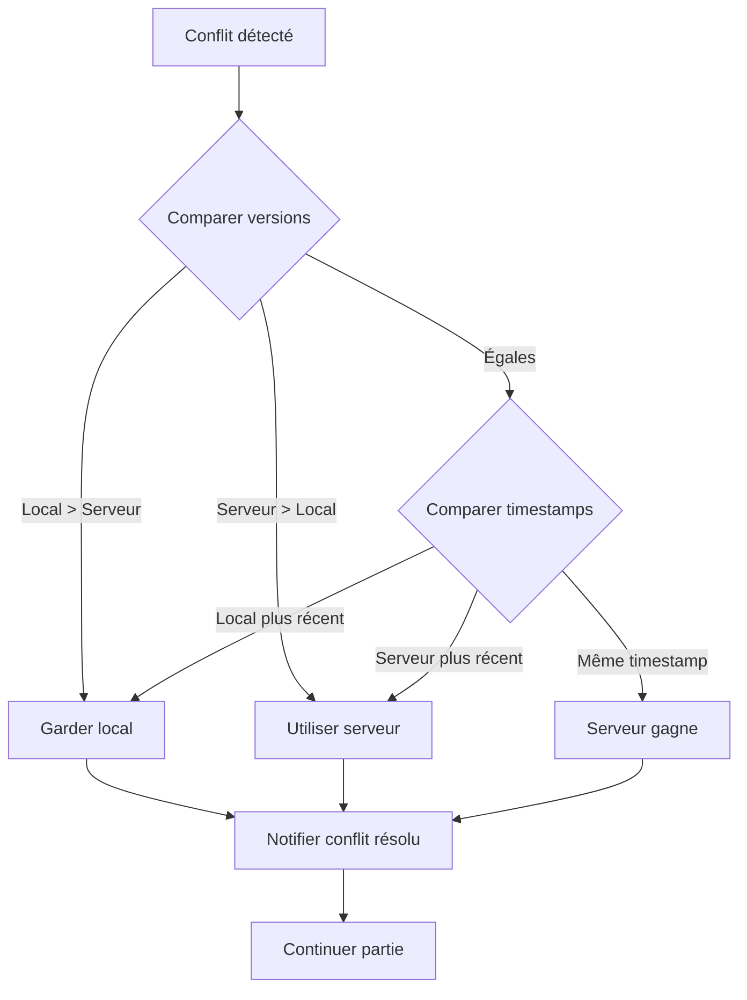

## Monitoring et Observabilité

### 1. Métriques Clés

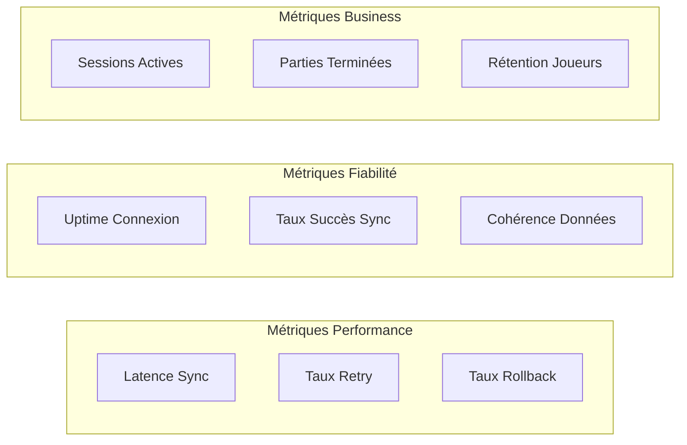

### 2. Points de Télémétrie

- **Synchronisation** : Temps de round-trip, échecs, retries
- **État Optimiste** : Nombre d'actions en attente, rollbacks
- **Realtime** : Latence messages, déconnexions, reconnexions
- **Base de Données** : Temps requêtes RLS, violations, performances
- **Expérience Utilisateur** : Temps de réponse UI, erreurs visibles

## Configuration des Environnements

### Développement
- **Sentry** : Mode debug, capture 100% des erreurs
- **Supabase** : Instance de développement, logs verbeux
- **Monitoring** : Dashboards locaux, alertes désactivées

### Staging  
- **Sentry** : Mode release, échantillonnage 50%
- **Supabase** : Instance de test, monitoring activé
- **Load Testing** : Tests de charge automatisés

### Production
- **Sentry** : Mode release optimisé, échantillonnage 10%
- **Supabase** : Instance production, alertes configurées
- **Monitoring** : Dashboards temps réel, escalades automatiques

## Références Techniques

- **GameSyncService** : `lib/features/multiplayer/data/services/game_sync_service.dart`
- **OptimisticState** : `lib/features/game/presentation/providers/optimistic_game_state_notifier.dart`
- **RLS Policies** : `supabase/migrations/` - Politiques de sécurité
- **Error Monitoring** : `lib/core/monitoring/multiplayer_error_monitor.dart`
- **Tests Intégration** : `test/integration/multiplayer/` - Suite de tests complète